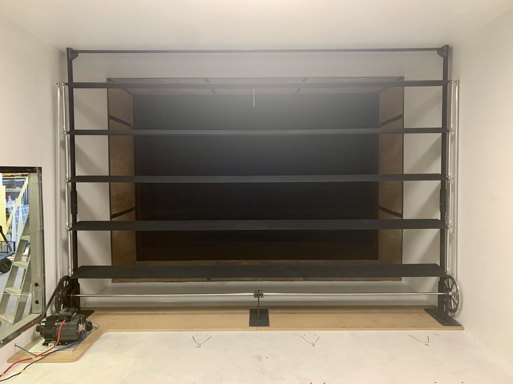
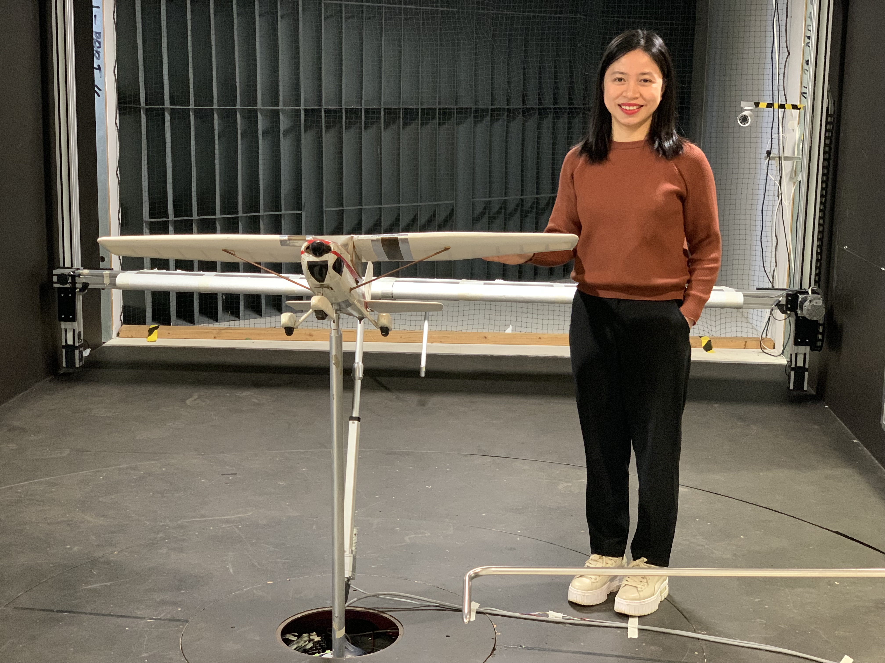

# Selected Engineering Projects

A selection of industry and research projects demonstrating mechanical design, structural analysis, aero-hydrodynamic calculations, and hydraulic and electrical system integration.

<strong>Geotechnical Drill Machine R011</strong>

 

<figure class="project-image">
  
  <figcaption style="text-align:center;">
    <em>Figure 1: Geotechnical Drill Machine R011 in travelling position</em>
  </figcaption>
</figure>

 

<figure class="project-image">
  
  <figcaption style="text-align:center;">
    <em>Figure 2: Geotechnical Drill Machine R011 in working position</em>
  </figcaption>
</figure>

 

<figure class="project-image">
  
  <figcaption style="text-align:center;">
    <em>Figure 3: Geotechnical Drill Machine R011 in working position - Side view with air coller, hydraulic pipe routing and hydraulic tank</em>
  </figcaption>
</figure>

 

<figure class="project-image">
  
  <figcaption style="text-align:center;">
    <em>Figure 4: Geotechnical Drill Machine R011 in working position - Front view with foot clamp - breakout assembly, stabilizer legs, drivehead unit, mast, leaf chain, energy chain and control console</em>
  </figcaption>
</figure>

 

<figure class="project-image">
  
  <figcaption style="text-align:center;">
    <em>Figure 5: Figure 5: R011 Control Console</em>
  </figcaption>
</figure>

### Project Overview

Design a custom drill machine for geotechnical purposes to meet specific operational and structural requirements:

- Addition of a 1.5 m folding mast extension to the original mast, capable of folding up during operation and down during transport.
- Redesign of the two rear stabilizer legs to allow rotation to specified angles instead of being fixed as in the original model.
- Development of a manually ratatable control console for improved operator accessibility.
- Lowering of the overall center of gravity of the drill machine.
- Reduction of drivehead travel distance to 1.5 m (from 1.75 m in the original model).
- Integration of a higher-capacity rotation motor.
- Design and implement of a drill rod storage rack. 

### Responsibilities

- Mechanical design of the folding mast with custom hinge solution, rotating stabilizer legs and rotating control console.
- Redesign of the overall drill machine layout to lower the center of gravity.
- Redesign of the foot clamp and breakout assembly to integrate newly specified custom hydraulic cylinders, ensuring proper alignment, force transmission, and operational reliability.
- Redesign of the rubber track system to align with the base frame using a standardized parallel flange channel (PFC) profile, achieving structural consistency, overall weight reduction and manufacturing cost optimization.
- Modification of the mast system using a leaf chain mechanism instead of a timing belt (as in the previous model).
- Design of rod storage rack and mud pump mounting system.   
- Selection of appropriate hydraulic fittings and hose tails for motors, valves, or other hydraulic components.
- Hydraulic pipe routing and system layout optimization.  
- Simulation of machine operation under different working conditions.
- Evaluation of machine performance under real loading conditions
- Development of a custom program to extract Bill of Materials (BOM) from Solid Edge assemblies to Google Sheets for inventory and order management.
- Preparation of detailed technical drawings for profiled, pressed, machined, tube-lasered and tube-bent parts, ensuring dimension accuracy, tolerances and compliance with relevant standards (particularly for components manufactured by overseas suppliers).
- Preparation of fabrication drawings for outsourced welding and assembly, ensuring proper geometric dimensioning and tolerancing (GD&T).
- Communication with suppliers to negotiate pricing and coordinate manufacturing processes, enusring on-time delivery of components and final machine delivery to client.
- Writing the user manual and commissioning checklists.

### Tools & Methods

- Solid Edge for 3D modelling, mechanical design and simulation.
- Collaboration with suppliers for custom cylinders tailored to system requirements and cost targets.
- Calculcations and selection of appropriate air cooler model for full system coverage.
- Pipe sizing calculations based on flow rates and pressure requirements.
- Removal of pivot frame height raisers to lower the center of gravity while ensuring no interference between assemblies.
- Layout optimization to ensure full cylinder stroke without collision between components.
- Development of a C# application to automatically extract BOM data from Solid Edge assemblies to Google Sheet, eliminating the need for the third-party services.

### Key Outcomes

- Successfully designed, manufactured, and delivered a custom geotechnical drill machine that met all specified requirements. 
- Achieve a more compact and optimized design compared to previous models.  
- Ensure smooth and reliable operation of the engine and hydraulic systems.

 

 

<strong>Geotechnical Drill Machine R010 for Solomon</strong>

 

<figure>
  
  <figcaption><em>Figure 6: Geotechnical Drill Machine R010 in working position in Solomon</em></figcaption>
</figure>

### Project Overview
Design a custom drill machine for geotechnical purposes to meet specific operational and structural requirements:
- Redesign of the energy chain system to improve reliability and operational stability.
- Change the location of wireline winch to prevent the interfernce between main winch ropes and wireline winch ropes.
- Replacement of flexible hydraulic hoses used in previous models with a hard-pipe system to achieve more compact and organized design.
- Redesign of the mounting configuration of hydraulic filters to improve accessibility, protection and system layout.

### Responsibilities
- Mechanical design of the energy chain system and hydraulic filter mounting system.
- Move the wireline line assembly to attach on the pivot frame instead of on the mast extrusion as in the previous models. 
- Selection of appropriate hydraulic fittings and hose tails for motors, valves, or other hydraulic components.
- Hydraulic pipe routing and system layout optimization.  
- Simulation of machine operation under different working conditions.
- Evaluation of machine performance under real loading conditions
- Preparation of detailed technical drawings for profiled, pressed, machined, tube-lasered and tube-bent parts, ensuring dimension accuracy, tolerances and compliance with relevant standards.
- Preparation of fabrication drawings for outsourced welding and assembly, ensuring proper geometric dimensioning and tolerancing (GD&T).
- Communication with suppliers to negotiate pricing and coordinate manufacturing processes, enusring on-time delivery of components and final machine delivery to client.
- Writing the user manual and commissioning checklists.

### Tools & Methods
- Solid Edge for 3D modelling, mechanical design and simulation.
- Collaboration with suppliers for hard-pipe manufacturing and the on-time delivery of hydraulic hoses and fittings.
- Pipe sizing calculations based on flow rates and pressure requirements.

### Key Outcomes
- Successfully designed, manufactured, and delivered a custom geotechnical drill machine that met all specified requirements. 
- Achieve a better compact and optimized design compared to previous models.  
- Ensure smooth and reliable operation of the engine and hydraulic systems.

 

 

<strong>Geotechnical Drill Machine R009 - a version integrated on the truck</strong>

 

<figure>
  
  <figcaption><em>Figure 7: Geotechnical Drill Machine R009 in working position</em></figcaption>
</figure>

 

<figure>
  
  <figcaption><em>Figure 8: Geotechnical Drill Machine R009 in travelling position</em></figcaption>
</figure>

### Project Overview
Design a custom drill machine for geotechnical purposes intergrated on a truck for convenient transportation at all terrains:
- Design of a spin cage to cover drivehead unit and enhance the health and safety while operating.
- Design of a throttle push-pull mechanism to mechanically control engine speed.
- Design the driveshaft to transmit the rotation of drievhead motor to the gearbox.

### Responsibilities
- Mechanical design of the spin cage, throttle push-pull mechanism installed inside the engine and the driveshaft.  
- Simulation of machine operation under different working conditions.
- Evaluation of machine performance under real loading conditions
- Preparation of detailed technical drawings for profiled, pressed, machined, and tube-lasered parts, ensuring dimension accuracy, tolerances and compliance with relevant standards.
- Preparation of fabrication drawings for outsourced welding and assembly, ensuring proper geometric dimensioning and tolerancing (GD&T).
- Communication with suppliers to negotiate pricing and coordinate manufacturing processes, enusring on-time delivery of components and final machine delivery to client.
- Writing the user manual and commissioning checklists.

### Tools & Methods
- Solid Edge for 3D modelling, mechanical design and simulation.

### Key Outcomes
- Successfully designed, manufactured, and delivered a custom geotechnical drill machine that met all specified requirements.  
- Ensure smooth and reliable operation of the engine and hydraulic systems.

 

 

<strong>Geotechnical Drill Machine R008 - a version for both normal drill function and Cone Penetration Test (CPT)</strong>

 

<figure>
  
  <figcaption><em>Figure 9: Geotechnical Drill Machine R008 in working position</em></figcaption>
</figure>

 

<figure>
  
  <figcaption><em>Figure 10: Geotechnical Drill Machine R008 in travelling position</em></figcaption>
</figure>

### Project Overview
Design a custom drill machine for geotechnical purposes - acting as a nornal drill machine and doing the cone penetration test (CPT):
- Redesign of the foot clamp and breakout assembly to suit the CPT function.
- Design of a mechanism integrating the translational motion of a cylider and the rotational motion from a motor to form a complete motion on the cone for CPT testing.
- Change the travel method of drivehead unit using a timing belt as classically into using a 3.5 m stroke cylinder. Modify the design of wireline winch to accommodate this change.
- Design a throttle system to electrically control the engine speed.
- Design the vertical energy chain system to support the movement of hydraulic hoses under the machine operations.
- Design the driveshaft to transmit the rotation of drievhead motor to the gearbox.

### Responsibilities
- Mechanical design of the foot clamp and breakout assembly, CPT testing assembly, mast extrusion, wireline winch assembly, throttle system for engine, vertical energy chain system on the base frame, and the driveshaft.  
- Simulation of machine operation under different working conditions.
- Evaluation of machine performance under real loading conditions
- Preparation of detailed technical drawings for profiled, pressed, machined, and tube-lasered parts, ensuring dimension accuracy, tolerances and compliance with relevant standards.
- Preparation of fabrication drawings for outsourced welding and assembly, ensuring proper geometric dimensioning and tolerancing (GD&T).
- Communication with suppliers to negotiate pricing and coordinate manufacturing processes, enusring on-time delivery of components and final machine delivery to client.
- Writing the user manual and commissioning checklists.

### Tools & Methods
- Solid Edge for 3D modelling, mechanical design and simulation.

### Key Outcomes
- Successfully designed, manufactured, and delivered a custom geotechnical drill machine that met all specified requirements.  
- Ensure smooth and reliable operation of the engine and hydraulic systems.

 

 

<strong>Drill Machine for Excavator Series R007</strong>

 

<figure>
  
  <figcaption><em>Figure 11: Drill Machine R007 - Excavator Series in working position</em></figcaption>
</figure>

### Project Overview
Design a custom drill machine attached to an excavator:
- Redesign of the foot clamp and breakout assembly to suit the CPT function.
- Design of a mechanism integrating the translational motion of a cylider and the rotational motion from a motor to form a complete motion on the cone for CPT testing.
- Change the travel method of drivehead unit using a timing belt as classically into using a 3.5 m stroke cylinder. Modify the design of wireline winch to accommodate this change.
- Design a throttle system to electrically control the engine speed.
- Design the vertical energy chain system to support the movement of hydraulic hoses under the machine operations.
- Design the driveshaft to transmit the rotation of drievhead motor to the gearbox.

### Responsibilities
- Mechanical design of the foot clamp and breakout assembly, CPT testing assembly, mast extrusion, wireline winch assembly, throttle system for engine, vertical energy chain system on the base frame, and the driveshaft.  
- Simulation of machine operation under different working conditions.
- Evaluation of machine performance under real loading conditions
- Preparation of detailed technical drawings for profiled, pressed, machined, and tube-lasered parts, ensuring dimension accuracy, tolerances and compliance with relevant standards.
- Preparation of fabrication drawings for outsourced welding and assembly, ensuring proper geometric dimensioning and tolerancing (GD&T).
- Communication with suppliers to negotiate pricing and coordinate manufacturing processes, enusring on-time delivery of components and final machine delivery to client.
- Writing the user manual and commissioning checklists.

### Tools & Methods
- Solid Edge for 3D modelling, mechanical design and simulation.

### Key Outcomes
- Successfully designed, manufactured, and delivered a custom geotechnical drill machine that met all specified requirements.  
- Ensure smooth and reliable operation of the engine and hydraulic systems.

 

 

<strong>Oscillating Rig to Replicate Wind Gust and Natural Wind Conditions - Rectangular Grid to Generate Turbulent Flows - Unmanned Aerial Vehicle (UAV) Testing</strong>

 

<figure>
  
  <figcaption><em>Figure 12: Oscillating Rig to Replicate Wind Gust and Natural Wind Conditions</em></figcaption>
</figure>

 

<figure style="text-align: center;">
  <video width="700" controls>
    <source src="./videos/active_grid_movement.mp4" type="video/mp4">
    Your browser does not support the video tag.
  </video>
  <figcaption><em>Video 1: Oscillating Rig Movement in the Wind Tunnel for Wind Gust Generation</em></figcaption>
</figure>

 

<figure>
  
  <figcaption><em>Figure 13: UAV Wing Testing under Wind Gust and Natural Wind Conditions</em></figcaption>
</figure>

 

<figure>
  
  <figcaption><em>Figure 14: Kahu UAV from New Zealand Defence Force employed in the study</em></figcaption>
</figure>

 

<figure>
  
  <figcaption><em>Figure 15: Working with other Aircraft Models</em></figcaption>
</figure>

 

<figure>
  
  <figcaption><em>Figure 16: Rectangular Grid to Generate Turbulent Flows</em></figcaption>
</figure>

### Project Overview
Investigate the performance of a small fixed-wing UAV under different wind conditions: Turbulent Flows - Wind Gusts - Natural Wind Situations
- Design of a rectangular grid to generate turbulent flows.
- Design of a oscillating rig for the purpose of generating wind gusts and replicating natural wind conditions. Program the servo motor of the rig so that the movement of the oscillating aerofoils can generate the wind gusts and replicate the natural wind conditions in the wind tunnel. 
- Test the performance of Kahu UAV (a small fixed-wing UAV from New Zealand Defence Force) under such extreme wind conditions.
- Establish a model to predict  the performance of an arbitrary UAV under such extreme wind conditions.

### Responsibilities
- Mechanical design of the oscillating rig and rectangular grid.  
- Generation of extreme wind conditions in the wind tunnel, including turbulent flows, wind gusts and natural wind situations.
- Testing of Kahu UAV under such extreme wind conditions. Analysis of data using advanced methodologies.
- Build of a mathematic model to predict the performace of small fixed-wing UAV under such extreme wind conditions.

### Tools & Methods
- Reading literature to have an overall insight of what has been done around the world.
- SolidWorks usage for 3D modelling, design and opearting simulations of the oscillating rig and rectangular grid.
- Manufacturing of the rectangular grid by myself - purchasing materials from Bunnings Warehouse and using hand-driller and nails for assembling the wooden bar together to create a complete rectangular grid.
- Preparation of detailed technical drawings for profiled, pressed, machined, and tube-lasered parts for the oscillating rig, ensuring dimension accuracy, tolerances and compliance with relevant standards to send to the workshop for manufacturing.
- Preparation of fabrication drawings for welding and assembly in the workshop, ensuring proper geometric dimensioning and tolerancing (GD&T).
- Design of other necessary components to mount the UAV wing and instrumentations in the wind tunnel to conduct the experiments.
- Installation of the oscillating rig, the rectangular grid and the UAV model in the wind tunnel for testing.
- Conduct the experiments, ensuring no data drift from instrumentations, collecting the data.
- Analysis of data using both simple and advanced methodologis.
- Based on the results, establish a mathematic model to predict the performance of arbitrary UAVs in such exterme weather conditions.

### Key Outcomes
- Find the key points in the operations of small fixed-wing UAVs under extreme weather conditions.
- Estabalish a mathematic model to determine the UAV performance under such weather conditions, which is the input for building the UAV control systems. 
- Successfully delivered a research at international PhD level with outstanding results. 

 

 

<strong>Investigation the performance of a stream tidal turbine under extreme flow conditions</strong>

 

<figure>
  
  <figcaption><em>Figure 17: Tidal Turbine Model</em></figcaption>
</figure>

### Project Overview
Investigate the performance of a stream tidal turbine under extreme flow conditions:
- Design of a tidal turbine with a novel approach to obtain the highest theoretical perferformance.
- Test the performance of the tidal turbine model in a flume under extreme flow conditions.
- Simulate the performance of the tidal turbine model using specific programs from Natioanl Renewable Energy Laboratory. 
- Compare the results between experiments and simulations and make a conclusion.

### Responsibilities
- Mechanical design of the stream tidal turbine to obtain the highest theoretical performance.  
- Conduct the testing of the tidal turbine model in the flume under extreme flow conditions.
- Do the simulations of the tidal turbine performance.
- Analyse the data and compare results.

### Tools & Methods
- Reading literature to have an overall insight of what has been done around the world.
- Inventor and Creo usage for 3D modelling and design of the stream tidal turbine model. The design must be waterproof so the electrical instrumentation installed inside the model can work properly under water.
- Preparation of detailed technical drawings for parts for the tidal turbine model, ensuring dimension accuracy, tolerances and compliance with relevant standards to send to the workshop for manufacturing.
- Preparation of fabrication drawings for welding and assembly in the workshop, ensuring proper geometric dimensioning and tolerancing (GD&T).
- Selection and order of electrical instrumentations for the experiments.
- Installation of the tidal turbine model in the flume for testing.
- Conduct the experiments, ensuring no data drift from instrumentations, collecting the data.
- Simulate the performance of the tidal turbine model using specific programs from National Renewable Energy Laboratory.
- Compare the results between two methodologies and make a conclusion.

### Key Outcomes
- Find the key points in the operations of stream tidal turbine model under extreme flow conditions.
- Validate the results between experiments and simulations. 
- Successfully delivered a high-quality research at Master level with outstanding results and a publication on a reputational journal. 

 

 
