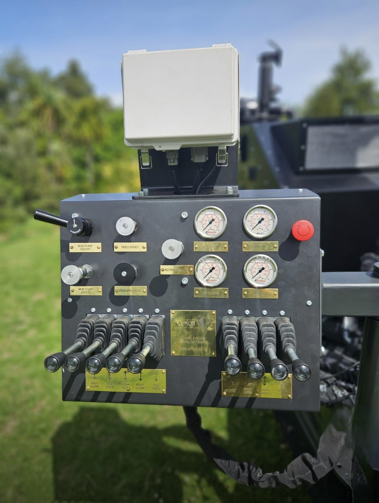

# Selected Engineering Projects

A selection of industry and research projects demonstrating mechanical design, structural analysis, aero-hydrodynamic calculations, and hydraulic and electrical system integration.

<strong>Geotechnical Drill Machine R011</strong>

 

<figure>
  
  <figcaption><em>Figure 1: Geotechnical Drill Machine R011 in travelling position</em></figcaption>
</figure>

 

<figure>
  
  <figcaption><em>Figure 2: Geotechnical Drill Machine R011 in working position</em></figcaption>
</figure>

 

<figure>
  
  <figcaption><em>Figure 3: Geotechnical Drill Machine R011 in working position - Side view with air coller, hydraulic pipe routing and hydraulic tank</em></figcaption>
</figure>

 

<figure>
  
  <figcaption><em>Figure 4: Geotechnical Drill Machine R011 in working position - Front view with foot clamp - breakout assembly, stabilizer legs, drivehead unit, mast, leaf chain, energy chain and control console</em></figcaption>
</figure>

 

<figure>
  
  <figcaption><em>Figure 4: R011 Control Console</em></figcaption>
</figure>

### Project Overview
Design a custom drill machine for geotechical purposes to meet specific operational and structural requirements:
- Addition of a 1.5 m folding mast extension to the original mast, capable of folding up during operation and down during transport.
- Redesign of the two rear stabilizer legs to allow rotation to specified angles instead of being fixed as in the original model.
- Development of a manually ratatable control console for improved operator accessibility.
- Lowering of the overall center of gravity of the drill machine.
- Reduction of drivehead travel distance to 1.5 m (from 1.75 m in the original model).
- Integration of a higher-capacity rotation motor.
- Design and implement of a drill rod storage rack. 

### Responsibilities
- Mechanical design of the folding mast with custom hinge solution, rotating stabilizer legs and rotating control console.
- Redesign of the overall drill machine layout to lower the center of gravity.
- Modification of the mast system using a leaf chain mechanism instead of a timing belt (as in the previous model).
- Design of rod storage rack and mud pump mounting system.   
- Selection of appropriate hydraulic fittings and hose tails for motors, valves, or other hydraulic components.
- Hydraulic pipe routing and system layout optimization.  
- Simulation of machine operation under different working conditions.
- Evaluation of machine performance under real loading conditions
- Development of a custom program to extract Bill of Materials (BOM) from Solid Edge assemblies to Google Sheets for inventory and order management.
- Preparation of detailed technical drawings for profiled, pressed, machined, tube-lasered and tube-bent parts, ensuring dimension accuracy, tolerances and compliance with relevant standards (particularly for components manufactured by overseas suppliers).
- Preparation of fabrication drawings for outsourced welding and assembly, ensuring proper geometric dimensioning and tolerancing (GD&T).
- Communication with suppliers to negotiate pricing and coordinate manufacturing processes, enusring on-time delivery of components and final machine delivery to client
- Writing the user manual and commissioning checklists

### Tools & Methods
- Solid Edge for 3D modelling, mechnical design and simulation.
- Collaboration with suppliers for custom cylinders tailored to system requirements and cost targets.
- Calculcations and selection of appropriate air cooler model for full system coverage.
- Pipe sizing calculations based on flow rates and pressure requirements.
- Removal of pivot frame height raisers to lower the center of gravity while ensuring no interference between assemblies.
- Layout optimization to ensure full cylinder stroke without collision between components.
- Development of a C# application to automatically extract BOM data from Solid Edge assemblies to Google Sheet, eliminating the need for the third-party services.

### Key Outcomes
- Successfullu designed, manufactured, and delivered a custom geotechnical drill machine that met all specified requirements. 
- Achieve a more compact and optimized design compared to previous models.  
- Ensure smooth and reliable operation of the engine and hydraulic systems.

 

 
